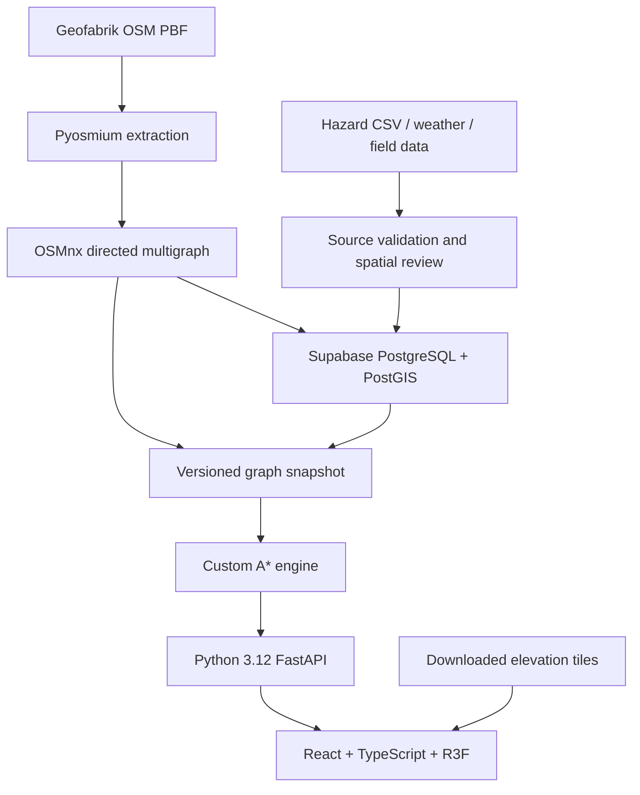

# Architecture and decisions

## Scope

Build one reliable route-planning workflow for logistics operators. The prototype compares time and modelled risk while respecting known vehicle constraints and road closures. All eight Northeast states have a data acquisition path. Runtime routing starts with a bounded pilot graph rather than loading the entire region into a browser.

## Components



Pyosmium is an input decoder for OSM's binary format, not an alternative graph engine. OSMnx handles graph preparation. PostGIS stores spatial data and produces reviewed hazard-to-road candidates. FastAPI serves the prepared graph from memory. Scenario changes remain local to a request.

## Routing objective

For each directed road segment e:

```text
r(e) = 0.5 × accident_score + 0.3 × surface_score + 0.2 × weather_score
t(e) = length_m / min(road_speed_mps, vehicle_speed_mps) × scenario_delay_factor
c(e) = t(e) × (1 + 4 × risk_aversion × r(e))
```

Scores lie in [0, 1]. The coefficients are prototype assumptions, not learned or calibrated safety probabilities. The fastest route minimizes Σt(e). The risk-aware route minimizes Σc(e). Separately, exposure is Σ(length_km × r(e)), expressed as risk-km. A cost reduction is not automatically an exposure reduction because the cost uses time-weighted risk. The UI reports the actual tradeoff, including negative exposure improvements if they occur.

The heuristic is the geodesic distance to the destination multiplied by the smallest base travel-seconds / endpoint-distance ratio in the graph. Every edge's base time is at least this multiple of the endpoint geodesic distance. Vehicle speed caps, weather delays and risk penalties only increase cost. Triangle inequality therefore gives a consistent lower bound for both objectives. Degenerate edges do not contribute a ratio. A zero factor falls back to Dijkstra-like expansion.

A* guides the search. The risk preference comes from edge costs. Dijkstra on the same costs is a correctness baseline and should find the same optimal cost.

## Graph semantics

- Preserve directed edge IDs, including parallel edge keys. A node-only path loses which bridge or carriageway the algorithm selected.
- Closures remove edges from the feasible search. A high finite cost would still allow a closed road when no alternative exists.
- Opposite directions are separate edges. Scenario definitions explicitly close both where intended.
- Enforce available numeric height, weight and width limits. Missing or ambiguous restrictions stay unknown. Strict mode excludes them.
- Retain disconnected components. Return a reachable status, not a fabricated route.
- Snap arbitrary coordinates to the nearest graph node within 2 km and report the snap distance. This is a prototype approximation; edge snapping and access-aware snapping are future work.
- Turn restriction relations, complex access conditions, multi-stop optimization and departure-time traffic are not yet represented.

## Data and temporal semantics

The base graph and each response carry a content hash. Network preparation occurs offline. A route request does not fetch OSM or write to Supabase.

Hazard records preserve source IDs, timestamps, coordinate accuracy and whether evidence is synthetic. Spatial proximity creates review candidates. A reviewer must resolve bridges, parallel roads, stale incidents and imprecise coordinates before a candidate affects routing. Historical incidents inform an exposure model only after this review. They do not automatically imply current closures.

The Supabase adapter currently round-trips base graph snapshots and imports hazard observations. It intentionally does not automatically transform unreviewed records into routing risk. The accepted-match scoring job is a next milestone with explicit calibration and expiry rules.

## API contract

| Endpoint | Purpose |
|---|---|
| `GET /health` | Loaded graph readiness |
| `GET /api/v1/bootstrap?dataset=demo` | Metadata, network choices, vehicle profiles, locations and scenarios |
| `GET /api/v1/network?dataset=demo&weather=normal&focus_node=...` | Bounded focused-area road GeoJSON and scenario risk values |
| `GET /api/v1/terrain?dataset=osm-guwahati` | Sampled elevation grid or null |
| `POST /api/v1/routes/compare` | Two route results, provenance and detour explanations |

```json
{
  "dataset_id": "demo",
  "origin": {"node_id": "n2_0"},
  "destination": {"node_id": "n2_6"},
  "vehicle": "heavy",
  "risk_aversion": 1.5,
  "weather": "normal",
  "closed_edge_ids": [],
  "strict_vehicle": false
}
```

Coordinates use WGS84 `[longitude, latitude]` in GeoJSON. Time is seconds internally and minutes in the UI. Road lengths are metres internally and kilometres in the UI. PostGIS geography casts give distance queries in metres.

## Runtime and deployment

Docker packages the FastAPI service and frontend separately. Kubernetes replicas load immutable graph snapshots. No mutable in-memory incident state is shared between replicas. A future update service should publish an atomic graph version and retain the previous version for reproducible comparisons.

Use persistent object storage or a versioned volume for large graph snapshots, not ConfigMaps. Start with one pilot graph per service or region shard. VM sizing must follow memory and latency measurements on actual regional graphs.

All eight state snapshots are discovered at startup but loaded only when selected. `GRAPH_CACHE_SIZE` bounds non-pilot graphs retained in each API process. The network endpoint returns a 15 km focused window with a hard feature cap by default, while route search still runs on the complete server-side state graph. This prevents full Assam geometry from being sent to the browser in one response. Production scale should replace this bounded GeoJSON view with cached vector tiles.

The browser sends no database credentials. Supabase tables have RLS enabled with no browser policies in the initial migration. Administrative ingestion uses a server-side SSL database connection. Before public deployment add authenticated operator access, rate limiting, audit logs and a reviewed retention policy for future GPS/field uploads.

## ML milestone

A* is a search method and the current risk function is rule-based. A predictive claim requires a labelled target, a feature lineage record and held-out evaluation. Candidate targets include road disruption within a defined future window or travel-time delay. Split by time and geography to avoid leakage. Compare the learned model to simple heuristics and report calibration, false alerts and missed disruptions before adding its scores to routing.
